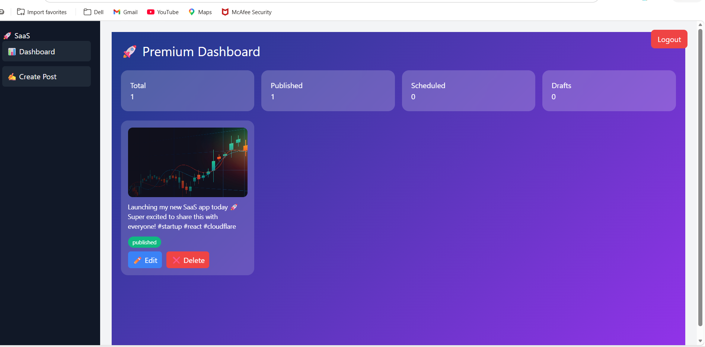
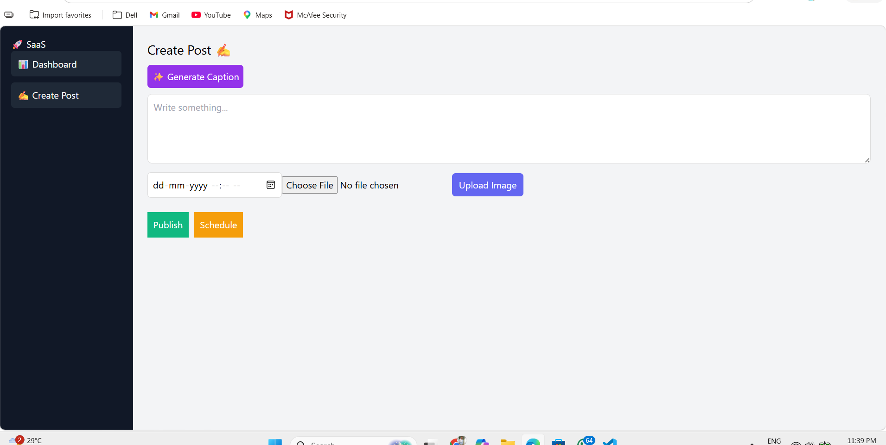

# 🚀 Social Media Publishing SaaS Platform

This is a full-stack Social Media Publishing SaaS platform built as part of the Cloudflare Full-Stack Internship assignment.

The application allows users to create, schedule, and manage posts across multiple social media platforms from a single dashboard.

---

## 🌐 Live Demo

Frontend (Cloudflare Pages):  
👉 https://7e2f7275.social-frontend-40m.pages.dev/

Backend (Cloudflare Workers):  
👉 https://social-backend.saas-backend.workers.dev

---
## 📸 Screenshots

### Dashboard

### Create Post

## 📌 Features

- 🔐 User Authentication (Login system)
- 📝 Create Posts (Text + Image)
- 📅 Schedule Posts for future publishing
- ⚡ Instant Publish option
- 🖼️ Media Upload support
- 📊 Dashboard for managing posts
- 🤖 AI Caption Generator (Innovation Feature)
- 🔗 API-based architecture (Frontend ↔ Backend)

---

## ☁️ Cloudflare Services Used

- Cloudflare Workers (Backend APIs)
- Cloudflare Pages (Frontend Hosting)
- Cloudflare R2 (Image Storage)
- KV / D1 (optional storage)

## 🏗️ Tech Stack

### Frontend (Cloudflare Pages)

- React.js (Vite)
- Tailwind CSS
- React Router

### Backend (Cloudflare Workers)

- Hono Framework
- REST API
- Token-based Authentication

### Cloudflare Services Used

- Workers (Backend APIs)
- Pages (Frontend hosting)
- KV (for tokens/session - optional)
- R2 (for media - optional)
- D1 (database - optional)

---
